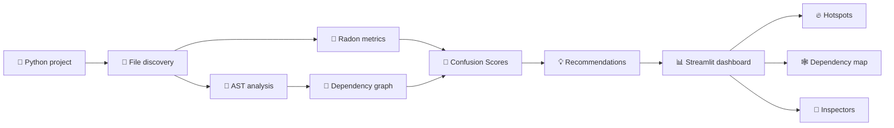

<div align="center">

# 🗺️ PyAtlas

### Turn a Python codebase into an explainable architecture map.

Find complexity hotspots, trace dependencies, uncover circular imports, and understand exactly why a module or function deserves attention—all from a private, local dashboard.

[](https://www.python.org/)
[](https://streamlit.io/)
[](#privacy)
[](#project-status)

[✨ Features](#features) · [🚀 Quick start](#quick-start) · [🧭 How to use](#how-to-use) · [🧠 Scoring](#confusion-score) · [🏗️ Architecture](#architecture) · [🛠️ Development](#development)

</div>

---

> [!IMPORTANT]
> PyAtlas reads source code on your computer. It does **not** upload code, execute the project being analyzed, or modify its files.

## 👋 Meet your codebase

Large Python projects rarely become difficult all at once. Risk collects quietly—in long functions, deep nesting, dense import relationships, oversized modules, and cycles that make every change harder to reason about.

PyAtlas brings those signals into one modern observatory:

| 🔭 See the structure | 🧠 Understand the risk | 🎯 Decide what to review |
|---|---|---|
| Explore modules, imports, fan-in, fan-out, and cycles. | Open every Confusion Score and inspect its metric contributions. | Filter hotspots, follow relationships, and export focused results. |

It is designed for investigation, not judgment. A high score is a prompt to look closer—not a declaration that code is bad.

<a id="features"></a>

## ✨ What you get

| Area | Capabilities |
|---|---|
| 🔎 **Discovery** | Recursive Python scanning, safe default ignores, custom glob patterns, and useful partial results when individual files fail. |
| 🌳 **Structure** | Functions, async functions, nested functions, classes, methods, parameters, branches, loops, calls, returns, and local bindings. |
| 📐 **Complexity** | Cyclomatic complexity and maintainability metrics powered by Radon. |
| 🔗 **Dependencies** | Internal import graph, fan-in, fan-out, isolated modules, relationship highlighting, and circular dependency groups. |
| 🧠 **Explainability** | Function-, class-, module-, and project-level Confusion Scores with raw values, normalized risk, weights, and point contributions. |
| 🔥 **Prioritization** | Sortable and filterable hotspots across functions, classes, and modules. |
| 📊 **Visualization** | Distribution charts, dependency-risk plots, file-scale comparisons, and an interactive dependency map. |
| 🔬 **Inspection** | Detailed module and function metrics, recommendations, relationships, and collapsible source previews. |
| 📤 **Export** | Complete analysis as JSON and focused hotspot data as CSV. |
| 🌓 **Interface** | Responsive, data-dense dashboard with full light and dark themes. |

<a id="quick-start"></a>

## 🚀 Quick start

### 1. Clone PyAtlas

```bash
git clone https://github.com/Steven-w65/PyAtlas.git
cd PyAtlas
```

### 2. Create a virtual environment

```bash
python -m venv .venv
```

<details>
<summary><strong>Activate the environment</strong></summary>

#### Windows PowerShell

```powershell
.\.venv\Scripts\Activate.ps1
```

#### Windows Command Prompt

```cmd
.venv\Scripts\activate.bat
```

#### macOS / Linux

```bash
source .venv/bin/activate
```

</details>

### 3. Install dependencies

```bash
python -m pip install --upgrade pip
python -m pip install -r requirements.txt
```

### 4. Start the dashboard

```bash
python -m streamlit run app.py
```

PyAtlas binds to `localhost` and opens in your browser.

> [!NOTE]
> PyAtlas requires **Python 3.12 or newer**.

<a id="how-to-use"></a>

## 🧭 How to use PyAtlas

1. Paste the **absolute path** of a local Python project into the sidebar.
2. Optionally enter project-relative ignore patterns, one per line.
3. Select **Analyze project**.
4. Read the project pulse and risk landscape.
5. Select a hotspot to highlight its direct dependency relationships.
6. Open the module or function inspector for metrics, explanations, recommendations, and source.
7. Download the complete JSON model or a hotspots CSV when you are done.

### 🚫 Ignore-pattern examples

```text
generated/**
legacy_*.py
examples/vendor/**
```

Patterns are evaluated relative to the selected project root.

<a id="confusion-score"></a>

## 🧠 Confusion Score

Confusion Score is an explainable structural-risk estimate from `0` to `100`. It combines signals that often increase the effort needed to understand, review, or safely change code.

| Score | Reading | Suggested response |
|---:|---|---|
| `0–20` | 🟢 Very Easy | No structural warning signals. |
| `21–40` | 🟢 Easy | Usually straightforward; inspect in context. |
| `41–60` | 🟡 Moderate | Review the largest score contributors. |
| `61–80` | 🟠 Difficult | Prioritize focused investigation. |
| `81–100` | 🔴 Very Difficult | Treat as a strong review signal. |

Every score keeps its calculation trail:

```text
Raw metric → Normalized risk → Weight → Point contribution → Explanation
```

<details>
<summary><strong>Function score weights</strong></summary>

| Metric | Weight |
|---|---:|
| Cyclomatic complexity | 25% |
| Function length | 20% |
| Nesting depth | 20% |
| Parameter count | 10% |
| Branches | 10% |
| Local variables | 5% |
| Function calls | 5% |
| Nested functions | 5% |

</details>

<details>
<summary><strong>What “local variables” means</strong></summary>

PyAtlas counts unique names bound in the function's own scope through assignments, loop targets, context-manager targets, exception handlers, assignment expressions, and structural pattern matching.

Parameters, comprehension-only targets, attribute and subscript writes, and bindings inside nested functions, classes, or lambdas are excluded.

</details>

Module scores also consider function risk, module length, dependency degrees, circular imports, maintainability, and class structure. Project scores combine a size-capped module average, hotspot prevalence, and circular-dependency risk so that one large file cannot dominate the result by size alone.

<a id="architecture"></a>

## 🏗️ How it works



```text
app.py                 Streamlit configuration and entry point
ui/                    Dashboard composition and session state
visualization/         Plotly charts and dependency graph rendering
services/              Analysis orchestration and exports
analyzer/              Scanner, AST, Radon, graph, scoring, recommendations
models/                Typed dataclass contracts shared across layers
tests/                 Unit tests and integration sample projects
```

`AnalysisService` is the application-facing analysis entry point. The analyzer, service, model, and visualization layers do not import Streamlit, keeping the deterministic core reusable and independently testable.

<a id="privacy"></a>

## 🔐 Privacy and safety

PyAtlas is intentionally local-first.

- ✅ Source remains on your computer.
- ✅ The analyzed project is never executed.
- ✅ Source files are never modified.
- ✅ Core analysis needs no external API.
- ✅ The web server binds to `localhost`.
- ✅ Invalid or unreadable files are reported without discarding all useful results.

<a id="development"></a>

## 🛠️ Development

Run the automated checks from the repository root:

```bash
python -m pytest -q
python -m compileall -q app.py analyzer models services ui visualization
```

### Project principles

- 🔍 **Inspection over judgment** — metrics guide investigation.
- 💡 **Explainability over mystery** — every score shows its inputs.
- 🏠 **Local over remote** — source stays on the user's machine.
- 🧱 **Separation over coupling** — analysis remains independent of presentation.
- 🧭 **Partial results over total failure** — one problematic file should not hide the rest.
- 🎯 **Determinism over novelty** — the core is reproducible without AI services.

### Contributing

1. Fork the repository and create a focused branch.
2. Add or update tests with your change.
3. Run the test and compilation commands above.
4. Open a pull request explaining the problem and your solution.

## ⚠️ Current boundaries

PyAtlas focuses on deterministic structural analysis of local Python projects. Keep these limits in mind:

- Static imports may not match runtime behavior involving dynamic loading or import hooks.
- Scores cannot understand business context or intentional architectural trade-offs.
- Invalid Python syntax limits AST and Radon analysis for that file.
- Source previews may differ from recorded metrics if a file changes after analysis.
- Module-name collisions are rejected instead of producing incomplete dependency metrics.
- Runtime performance, Git history, pull requests, and non-Python languages are not analyzed.
- Persistent result caching and duplicate-code detection are outside the current MVP.

<a id="project-status"></a>

## 🛣️ Project status and roadmap

PyAtlas is a fully working local MVP focused on explainable code intelligence.

- [x] Structural Python analysis
- [x] Explainable multi-level scoring
- [x] Interactive dependency exploration
- [x] Responsive light and dark dashboard
- [x] JSON and CSV exports
- [ ] Command-line interface
- [ ] CI threshold checks
- [ ] Duplicate-function detection
- [ ] Git-aware comparisons
- [ ] Historical score tracking
- [ ] Architecture-drift visualization

Optional AI-assisted explanations may be explored later, but they will remain separate from PyAtlas's deterministic analysis core.

---

<div align="center">

### 🗺️ See the structure. Understand the pressure. Review with intent.

If PyAtlas helps you navigate a difficult codebase, consider giving the project a ⭐.

</div>
